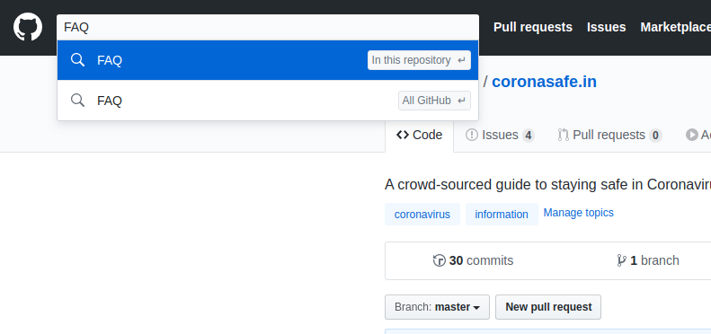

# Contribute

This is a crowd sourced guide and is meant to be always updated with the latest development in COVID-19. For that we need help from awesome contributors and volunteers.

## Using Github \(If you are not a developer\) 

#### 1. Sigin up at [https://github.com/](https://github.com/)

#### 2. Visit coronasafe repository 

A repository is where we keep the file.   
You can view it by visiting [https://github.com/coronasafe/coronasafe.in](https://github.com/coronasafe/ml.coronasafe)

#### 3. Find the file you want to Update 

  
Each file in the repository is an article in corona safe. You can find the file you are looking for by searching it. Example: If i want to update FAQ, I can search FAQ on the top left bar

Find the file you want to change and update the file. Follow this content [https://help.github.com/en/github/managing-files-in-a-repository/editing-files-in-your-repository](https://help.github.com/en/github/managing-files-in-a-repository/editing-files-in-your-repository) 

If you are stuck. Join our slack channel [http://slack.coronasafe.in/](http://slack.coronasafe.in/) and ask for help. 

## Forking the Repository 

1. Fork the GitHub repo [https://github.com/coronasafe/coronasafe.in](https://github.com/coronasafe/coronasafe.in)
2. Create a new file with `.md` extension.
3. Update the path to file in `README.md` \(The front page\) & `SUMMARY.md` \(for ordering in sidebar\)
4. Use Markdown language for updating the script.
5. Make a PR for merge.

## Using Email 

Drop us an email at [coronasafe.in@gmail.com](mailto:coronasafe.in@gmail.com)

